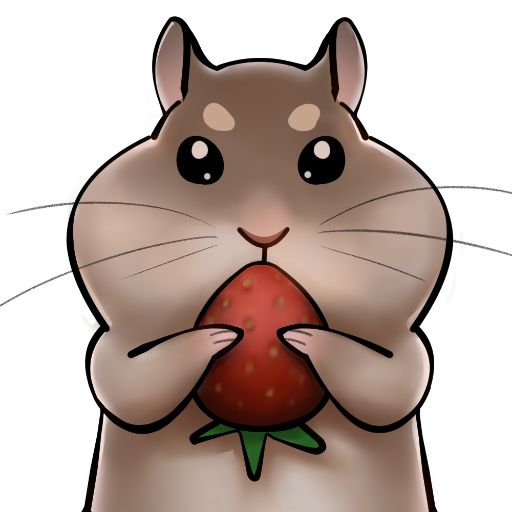

# NomNom

## App Icon



## Description
NomNom is a social media platform that combines recipe discovery and ingredient tracking. It helps users explore new meals, manage their ingredients efficiently, and engage with a community of cooking enthusiasts.


## Setup nstructions

### Frontend
#### Setup
```
cd frontend
npm install
npm install react-icons
npm install sass
```
#### Running
```
npm start
```

## Contributors
Risa Sun\
Diego Paz\
Dohyun Kim\
Jessica Wu

## Additional Information
NomNom was made as a project for CS35L taught by Professor Paul Eggert at UCLA in Winter 2025.
